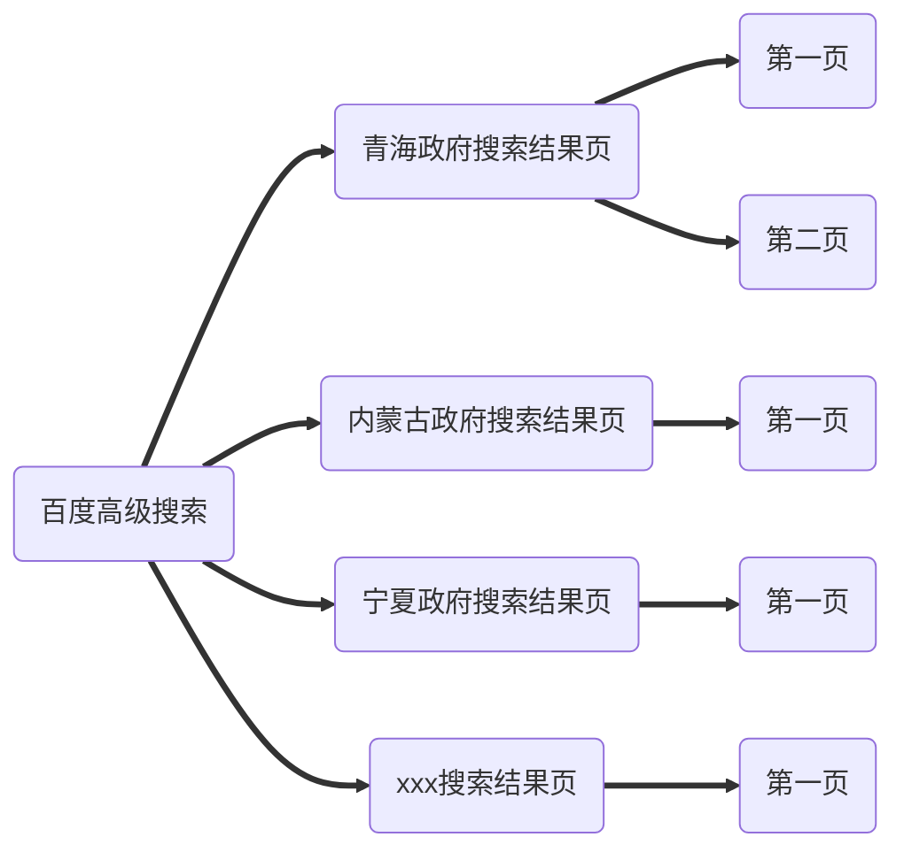
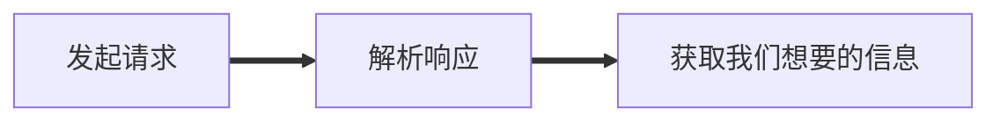
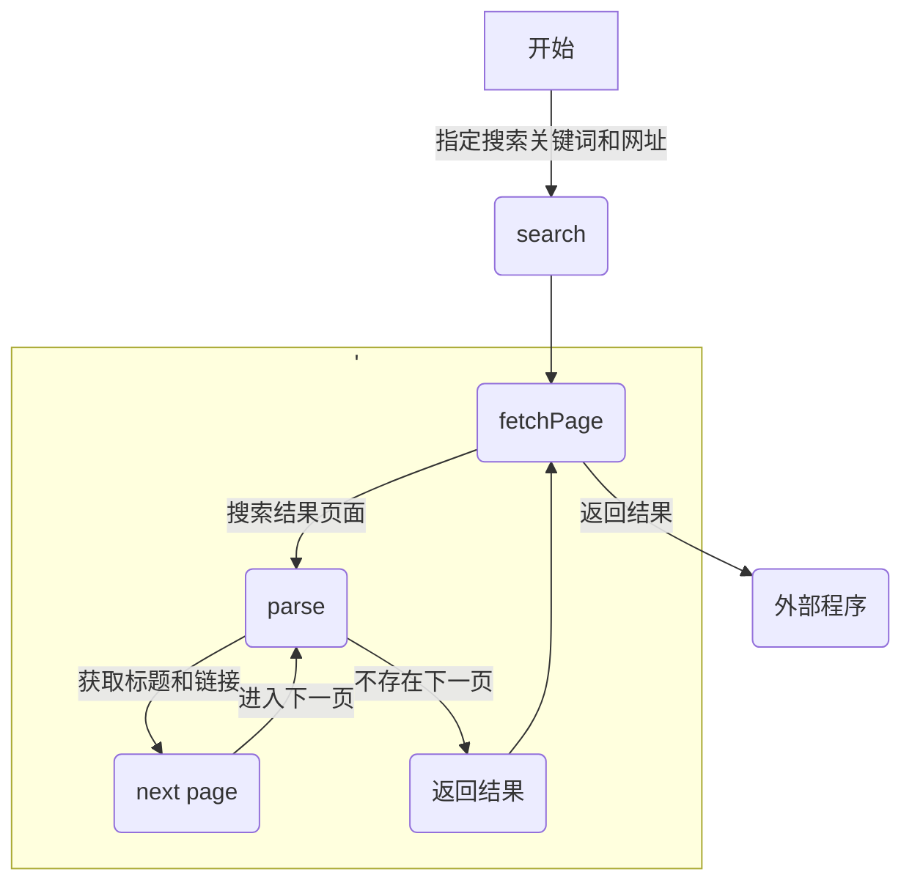

## 什么是爬虫
能够在无需人类干预的情况下自动进行一系列 Web 事务处理的软件
程序，简单来说就是自动利用网络客户端来自动的做一些事情

## 需求
通过指定**网址、关键词、时间**等，通过百度搜索出相关内容，然后爬取出所有结果的**标题、链接**

## 工作方式
爬虫从一个**初始的 URL 集合**开始，然后递归遍历所有的网站



这次实现的爬虫程序，从网络结构上来看比较简单，主要从 [高级搜索 (baidu.com)](https://www.baidu.com/gaoji/advanced.html) 页面为起点，然后遍历搜索每一个站点
![[scrap-advance-search.png]]
关于网络爬虫，一般网站都有一个约定告诉爬虫哪些可以爬取，哪些不可以
- https://en.wikipedia.org/robots.txt
- https://www.taobao.com/robots.txt

## 选择合适的 http 客户端

所以我们需要一个 http 客户端，http 客户端有两种可以选择
- 直接发起请求
- 通过代码控制浏览器发起请求
第一种有 [Requests: HTTP for Humans™ — Requests 2.28.1 documentation](https://requests.readthedocs.io/en/latest/) 等
第二种有 puppeteer playwright selenium 等

这两种的主要区别在于，puppeteer 这种客户端可以更好的模拟浏览器操作，因为他是通过**开发工具协议**来直接控制浏览器
## puppeteer 简介
下面是一个使用 puppeteer 的的例子
```js
import puppeteer from "puppeteer"

async function run() {
	// 启用浏览器
	const browser = await puppeteer.launch({
		headless: true,
	})
	// 获取一个页面
	const page = await browser.newPage();
	// 跳转登录页
	await page.goto("http://192.168.0.104:8000/login.html")
	// 截图
	await page.screenshot({path: "./test.png", fullPage:true})
	// 关闭浏览器
	await browser.close();
}

run().catch(error => console.log(error.message));

```
上面的这段代码会打开登录页，然后截图。整个过程和真实用户使用浏览器操作别无二致，因此模拟浏览器来爬取信息就不用担心网页上**动态加载的内容**（比如通用 ajax 动态请求的内容），只要数据会在页面上显示出来，那么就可以通过解析页面来获取指定的数据

### 利用 puppeteer 解析页面
使用 puppeteer 发起请求获取到页面之后，需要解析页面，才能获取到关键的信息，对于 html 的解析，puppeteer 提供了一些选择器API 来查询指定的 html 元素
```js
Page.$(selector);
page.$$(selector);
```
这两个 API 都是符合 css 规范的 API，puppeteer 还提供了其他选择器 api，例如 xpath 等等
该 API 会使用 `document.querySelector(selector)` 在页面上查询指定的元素，并将结果异步返回，`page.$$(selector)` 则使用 `document.querySelectAll(selector)` 来查询页面所有指定的元素，解析页面有三个目的 
1. 提取关键信息
2. 找到可交互元素（输入框，单选框之类），然后提交信息
3. 找到下一页

不管是哪种目的，找到关键元素都是第一步，以百度高级搜索页面为例，他的所有输入框都是如下样式
```html 
<input size="35" name="q3" maxlength="100">
<input id="keyword" size="35" name="q1" maxlength="100">
<input size="35" name="q4" maxlength="100">
```
如果要找到这些输入框，并且输入文字，那么该怎么做呢？
```js
// 找到元素
const element = awiat page.$("input[name=q3]");
// 输入文字
element.type("some text")

```
也可以直接指定选择器，然后输入文字
```js
await page.type("input[name=q3]", keyword);
```

利用这些知识，可以完善一下上面的例子，来登录现在的系统
```js
import puppeteer from "puppeteer"

async function run() {
	const browser = await puppeteer.launch({
		headless: true,
	})

	const page = await browser.newPage();
	// 跳转新页面
	await page.goto("http://192.168.0.104:8000/login.html")
	/*=========================新增===========================*/
	// 输入用户名
	await page.type(".login-content input[type=text]", username)
	// 输入密码
	await page.type(".login-content input[type=password]", password)
	// 点击登录
	await Promise.all([
		page.click(".login-content button"),
		page.waitForNavigation(),
	])
	/*=========================新增===========================*/
	// 截图
	await page.screenshot({path: "./test.png", fullPage:true})
	// 关闭浏览器
	await browser.close();
}

run().catch(error => console.log(error.message));

```

和我们手动操作登录是一一对应的，需要注意的是在我们去和元素交互之前，需要保证元素已经存在并且是可以交互的，可以使用 puppeteer 提供的 wait 系列的 API 比如
`page.waitForSelector(selector)`，同样的, 如果要对页面做某些操作，也需要保证页面被加载出来，在上面的代码当中在点击登录之后，需要等待页面导航到我们的首页，所以需要 `page.waitForNavigation()` 

## 程序结构
整个程序的结构如下，

这里的程序结构和之前的[工作方式](##工作方式)示意图是一致的, 都是先获取从百度高级搜索页面获取到网站的第一页的搜索结果，然后解析，然后下一页，等待**当前网站的所有页面**都解析完了，然后开始爬取下一个网站的信息。值得注意的地方在于，尽量避免获取下一页时出现循环，因为在翻页的地方，上一页和下一页的元素特征是相似的，因此在要格外注意 css 选择器的正确性
```html
<div>
<a class="n" href="...">&lt; 上一页</a>	
<a class="n" href="...">下一页&lt;</a>
</div>
```

## 常见的问题
```ad-note
title: 验证码问题
在请求的次数和频率达到一定量级之后，百度会出现如下的验证码, 目前的解决方法是，只要检测到**重定向**到验证码界面，就开启一个浏览器然后重新导航到该验证码界面**手动进行验证**
~~~ts
if (await page.$(validate_page_selector)) {
	console.log("开始验证");
	is_validate_page = true;
	await inputCode(page.url());
	console.log("验证结束");
} else if (await page.$(none_selector)) {
	console.log("空页面");
}
~~~
```

```ad-note
title: 使用本地的 chrome
由于 puppeteer 是通过 **devtool 协议**来控制浏览器的，所以至少需要一个 chromium 系列的浏览器才能使用，为了避免最后的程序过大，可以选择使用本地的 chrome 浏览器，puppeteer 提供了两个库
- puppeteer
- puppeteer-core

puppeteer 会自动下载 chromium ，而 puppeteer 是一个 puppeteer 的轻量级版本，是不带 chromium 的，由于系统的差异 Windows 和 MacOS 或者其他的 Linux 发行版本 chrome 路径是不一致的，这里推荐使用 [chrome-launcher](https://github.com/GoogleChrome/chrome-launcher) 来获取到本地 chrome 浏览器的安装路径启动 chrome 浏览器
~~~ts
import {getChromePath} from "chrome-launcher";
const browser = await puppeteer.launch({
	headless: true,
	executablePath: getChromePath(),
})
~~~
也可以直接使用 chrome-launcher 启动 chrome 浏览器，然后 puppeteer 通过 [Puppeteer.connect() method](https://pptr.dev/api/puppeteer.puppeteer.connect/) 连接到这个浏览器实例
~~~ts
const chromeLauncher = require('chrome-launcher');
const puppeteer = require('puppeteer');
const lighthouse = require('lighthouse');
const request = require('request');
const util = require('util');
(async() => {
	const URL = 'https://chromestatus.com/features';
	// Launch chrome using chrome-launcher.
	const chrome = await chromeLauncher.launch();
	const port = chrome.port;
	// Connect to it using puppeteer.connect().
	const resp = await util.promisify(request)(`http://localhost:${port}/json/version`);
	const {webSocketDebuggerUrl} = JSON.parse(resp.body);
	const browser = await puppeteer.connect({browserWSEndpoint: webSocketDebuggerUrl});
	await browser.disconnect();
	await chrome.kill();
})();
~~~
```

## 现有的缺点
- 速度慢
- 对百度的验证码无能无力
- 错误处理，还有部分错误没有被 catch 到
当前的爬取速度大概是 2-3 页每秒，并不是做不到更快，而是由于验证码的限制，要减少请求的频率，另外在程序当中会偶尔出现无法解析的页面，会浪费部分时间

## 可能的优化方式
- 将数据持久化，将爬取到的数据存储到内存或者存储到本地文件
- 多页面并行爬取，但是可能更快的触发页面的反爬虫
- 输入验证码时不阻塞主线程, 继续爬取搜索下一个网站

## 反验证码策略
- 代理 IP
- 机器学习
- 人工打码平台
验证码并非不可解决，但代价是什么呢，
- 金钱（可用的优质代理 IP，人工打码平台）
- 时间（了解相关知识，模型训练）

参考
-  https://pptr.dev/guides/query-selectors 