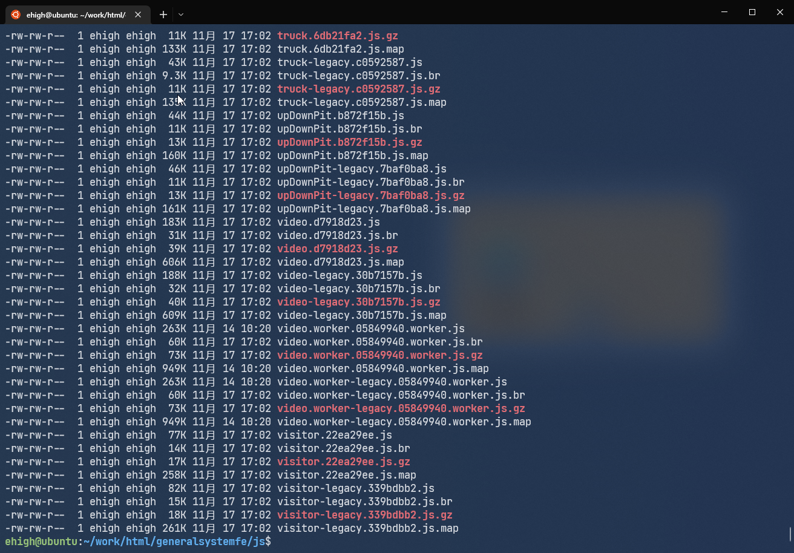
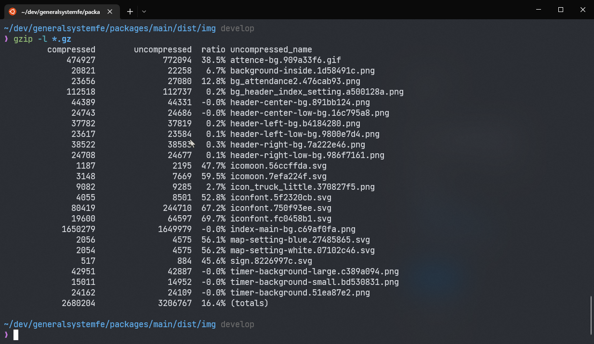
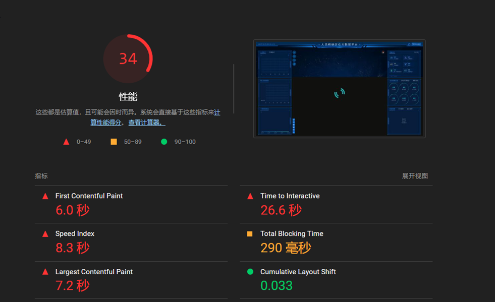

## 背景
现在需要将系统运行在低成本的服务器上，低成本意味着低性能，和低带宽。就低带宽而言需要对现有的系统网络请求进行优化
优化的手段主要有两个
- 缓存
- 压缩

### 缓存
关于 http 缓存的前置知识可以参考 [[HTTP-Cache]]
主要思路就是，对于已经版本化的文件，代码、图片、字体可以直接加强缓存（类似 `chunk.abc12341234.js` 这样带个版本号的文件），其他文件则可以加协商缓存，可以看到所有静态资源的请求都是用充分利用了缓存的
强缓存的特点是，一直保持不变，协商缓存即使使用了缓存也会存在一次网络请求，
而强缓存永远不会有网络请求，除非主动清除缓存

#### 分析
对于 js css img fonts 文件名都是经过了哈希处理的直接加上强缓存

代码如下：
```js
const cache_dir = [
  join(__dirname, "js/"),
  join(__dirname, "css/"),
  join(__dirname, "img/"),
  join(__dirname, "fonts/"),
]
app.use(conditional());
app.use(etag());

app.use(KoaStatic(join(__dirname, "./"), {
	extensions: ["html"], setHeaders(resp, path) {
	// 通过判断请求资源的路径前缀是否和我们指定缓存目录的资源路径匹配来设置缓存
	if(cache_dir.some(dir => path.startsWith(dir))){
		resp.setHeader("Cache-Control", "max-age=31536000, immutable")
	}
}}));
```
比如说请求资源的路径是 `/home/ehigh/work/html/generalsystemfe/img/index-main-bg.c69af0fa.png` 
通过对比每个请求资源在服务器的路径，判断是否进行强缓存


协商缓存： 使用 ETag 来做协商缓存，每次对比请求头的 ETag 和服务器端生成的 ETag 是否一直来判断是否使用缓存，服务器的 ETag 使用的是 `koa-etag` 库，是利用文件的更新时间和文件的大小生成的 hash 字符串


### 文本压缩
对静态资源进行压缩也是一个节省带宽的好方法！最开始是直接在服务器上收到请求的时候才进行压缩，有两个缺点浪费 CPU 时间和增加请求响应时间，后面改成了在**构建过程中**进行压缩。压缩是通过 vue-cli 的一个插件完成的 [vue-cli-plugin-compression](https://github.com/AnWeber/vue-cli-plugin-compression)，这个插件是使用了 webpack 的一个插件 [compression-webpack-plugin](https://github.com/webpack-contrib/compression-webpack-plugin) 这个 webpack 插件使用 [google/zopfli)](https://github.com/google/zopfli) Javascript 压缩库。通过在 `vue.config.js ` 文件当中指定要压缩的文件即可
```js
// vue.config.js
module.exports = {
	pluginOptions: {
		compression: {
			brotli: {
				filename: "[file].br[query]",
				algorithm: "brotliCompress",
				include: /\.(js|css|html|json)(\?.*)?$/i,
				compressionOptions: {
					params: {
						[zlib.constants.BROTLI_PARAM_QUALITY]: 11,
					},
				},
				minRatio: 0.8,
			},
			gzip: {
				filename: "[file].gz[query]",
				algorithm: "gzip",
				include: /\.(js|css|html|json)(\?.*)?$/i,
				minRatio: 0.8,
			}
		}
	},
};

```
以下是压缩之后的文件

**每个文件基本上能够节省 70%~80%左右的带宽**

文件压缩率对比 `gzip -l *.gz`

| HTML  | CSS   | Javascript|
| ----- | ----- | ----- |
| 58.2% | 75.8% | 74.9% |


### 网络传输当中如何使用压缩

想要使用压缩，必须客户端支持，浏览器通过指定请求头中的
```
Accept-encoding: gzip br deflate
```
来表明支持**gzip brotli defalte**格式的压缩算法
当请求发送给服务器之后，服务器最终决定使用哪种**压缩算法**，然后通过指定响应头中的
```
Content-Encoding: gzip
```
来告诉浏览器：“hey，我们使用 gzip 吧😘”


## 引申

在实践中，一般只对文本文件压缩，为什么不对图片压缩呢？
如上图所示，对 png 格式的图片采用 gzip 压缩，可以看到基本没有效果，这是因为 png 编码之后的结果也是经过了 Deflate 压缩的 


## 性能测试 
- 桌面环境浏览器
- 分辨率 1920x1080
- 带宽 2M (设置浏览器的 devtools 2M)

### 测试结果
- 无缓存的情况下

- 有缓存的情况


### 网络传输资源大小对比（首页）
| 无缓存无压缩 | 有缓存有压缩 |
| ------ | ------ |
|   27 MB     |    236 kB    |
完全没有缓存的情况下，通过网络传输的资源大概会有 27 MB 左右，当利用了缓存和压缩之后整个系统通过网络传输的资源的大小骤降在 236KB 左右

## 结论
在网络环境较差的情况，通过优化网络请求，增加压缩和缓存，能够极其显著的改善用户的体验，并且节省服务器带宽节省成本。


