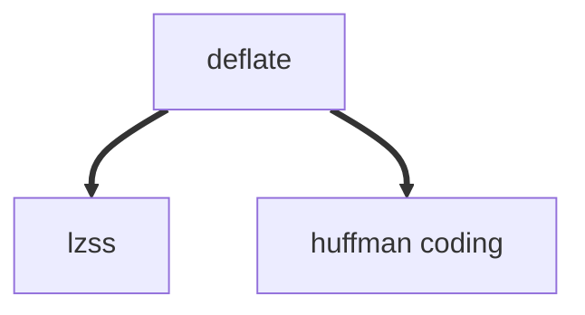

HTTP 通过 `content-encoding` 指定内容编码，以下是 http 的压缩相关的内容编码：
- gzip(GNU zip)
- deflate(zlib)

在 HTTPS 当中还有 `brotli` 压缩编码 [Brotli header is only sent on HTTPS connections (google.com)](https://groups.google.com/g/brotli/c/fN6M9A8aRnM)

主要简单介绍一下，gzip 和 deflate 两个压缩格式和相关的压缩算法
## 历史
现在所有的无损压缩算法基本上都可以追溯到两个压缩算法 **LZ77**和**LZ78**
LZ77 算法基于反向引用，它将文本当中一些重复的地方用三元组 $\langle distance, length, character\rangle$ 表示
```js
document.addEventListener("click", f);

document.addEventListener("click", g);
```
看上面这段 JavaScript 代码，LZ77 会怎么处理呢，它将 `document.addEventListener("click", ` 这部分用一个元组替代
```
document.addEventListener("click", f);

<40, 32> g);
```
这里的元组代表什么意思呢？这里的 40 代表向前回退 40 字节，32 代表复制 32 个字节

肉眼可见，整段文本被缩小了，但是有一个很明显的问题是，所谓文件内容在计算机当中都是一些字节，当完成压缩之后，怎么保证文件里面的元组是通过压缩算法生成的而非文件本身的内容如此，LZ77 用了一个显得有点呆瓜的方法，那就是将所有的文字内容通过元组形式表示,所以，假设有以下文本
```
abcc
```
那么就会变成
```
<0,0,a><0,0,b><0,0,c><1,1,_>
```
从 $a \to \langle 0,0,a \rangle$ 显然占据的空间更多了，这样直接的方式，肯定在某种情况下会出现不仅不会压缩文件，而且文件本身还会变大的滑稽情况
![[http-compression-lz77.png]]

### LZSS
大概五年之后，LZSS 压缩算法被创建，LZSS 是 LZ77 的变种算法之一，相比于 LZ77 用三元组 $\langle d,l,c\rangle$ 来表示每一个字，LZSS 会用一个 bit 来表示一个字节是字面量还是三元组，LZSS 会权衡该字节到底是使用三元组来表示或者直接使用字面量。
```
00000001 11111111 ...
```

## gzip
言归正传，所以到底什么是 GZIP 呢，gzip 其实就是 DEFALTE 
![[meme-gzip.png]]
当然，gzip 还在外面包装了一层，增加更多的信息，比如文件名时间戳循环冗余检验等
也就是这一段 ![[http-compression-gzip-header.png]]

而 Deflate 是基于 LZSS 和 Huffman Coding

基本上就是用 LZSS 跑一遍然后用 Huffman  Coding 优化编码

### 网络传输当中如何使用压缩
![[http-img.png]]
想要使用压缩，必须客户端支持，浏览器通过指定请求头中的
```
Accept-encoding: gzip br deflate
```
来表明支持**gzip brotli defalte**格式的压缩算法
当请求发送给服务器之后，服务器最终决定使用哪种**压缩算法**，然后通过指定响应头中的
```
Content-Encoding: gzip
```
来告诉浏览器：“hey，我们使用 gzip 吧😘”


## 引申
![[optimize-compress-image.png]]
在实践中，一般只对文本文件压缩，为什么不对图片压缩呢？
如上图所示，对 png 格式的图片采用 gzip 压缩，可以看到基本没有效果，这是因为 png 编码之后的结果也是经过了 Deflate 压缩的 


参考
- [【数据压缩】LZ77算法原理及实现 - Treant - 博客园 (cnblogs.com)](https://www.cnblogs.com/en-heng/p/4992916.html)