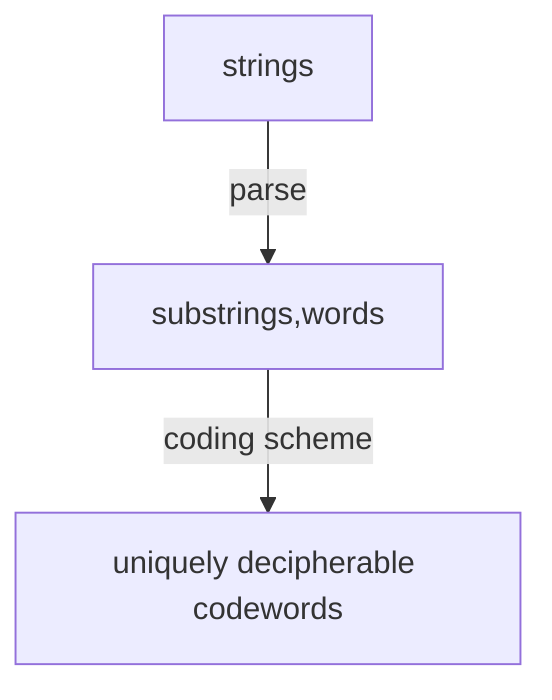

基本上，LZ77 采用了通过包含最近过去输入的缓存当中进行最大长度的复制，从源输入编码未来的输入。
LZ77 使用反向引用来标记重复的信息，反向引用是一个三元组 $\langle D, L, C\rangle$, 
D 代表距离重复文本的距离，L 是重复文本的长度，C 是下一个字符，如下是一个简单的例子
```
abad
```
编码后
```
ab<2,1,a>d
```
数据在计算机当中都是以一个一个字节存储，无法区分如何区分文本和反向引用标记，比如假设文本当中本来就有 $\langle2, 1,a\rangle$ 这个三元组（意思是可能和三元组的二进制序列对应上），那么又该如何区分呢，LZ77 的做法是将输入全部变成三元组的形式，这样就解决了问题，但是非常显然的是，这样做非常低效，本来也许用一个字节就能表示一个字符，现在却需要更多字节来表示，这与想要压缩的目的背道而驰
编码后
```
<0,0,a><0,0,b><2,1,a><0,0,d>
```


## 如果长度超过距离
在三元组当中 $\langle D, L, C \rangle$ 如果长度 $L$ 超过 $D$ 





预设的词长度 $L_{s}$ 和固定长度的可译码的长度 $L_{c}$ (三元组) 关系如下，对数的 base 是字母表 A 的成员数量，n 是已经输入的过去已经输入的 buffer 的长度
```
heisheafreak
```
$L_{c}=1 + \lceil \log(n-L_{s})\rceil + \lceil \log(L_{s})\rceil$

abcds        adfsad          fsaf 


## 术语
- bounded delay 有界延迟，网络中数据遍历整个网络的总延迟不超过某个预设的值
- cardinality 一个集合中基本成员的数量