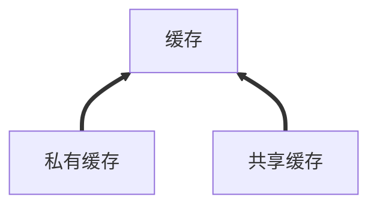
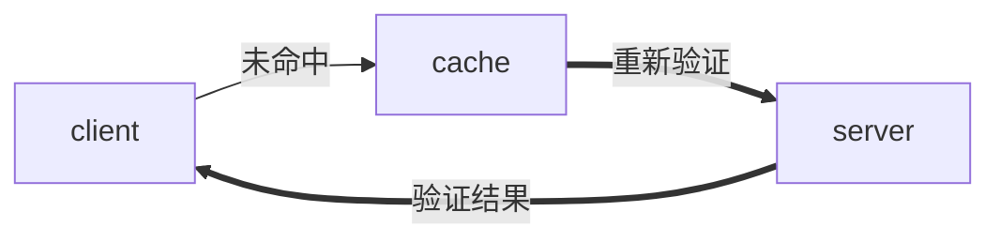
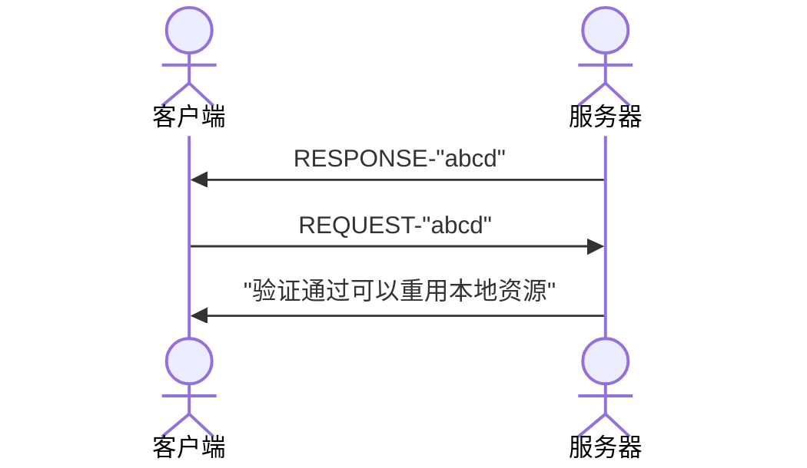
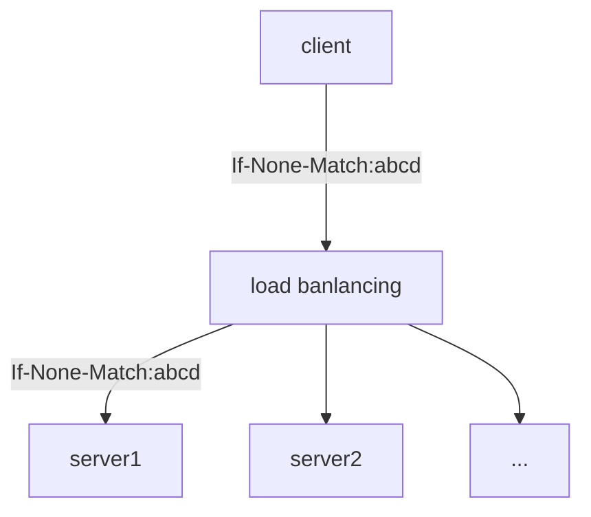
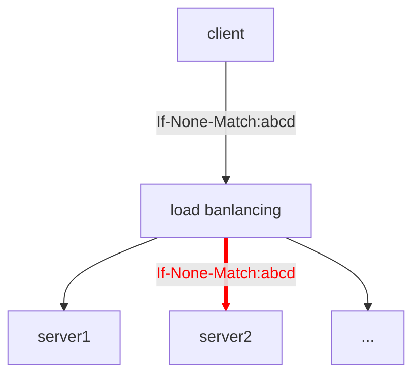

### Http 的缓存是个啥
众所周知，走 50 米和走 100 米所花费的时间不一样，同理我们从源服务器获取取数据和我们从本地取数据所花费的时间也不一样。http 的缓存就是一个将响应存储在离我们更近的地方以方便在接下来的请求当中，快速获取数据的机制。

这里所谓的近的地方，一般来说是指浏览器或者代理、反向代理、CDN 等。相对于源服务器，我们从这些的地方获取数据的成本要小得多。

对于 http 来说缓存是一个可选的功能，但是对于大部分情况使用缓存都能获得明显的收益 (节省带宽和提高响应速度)

在术语中称浏览器为私有缓存，而代理、反向代理、CDN 这种为共享缓存（[其实对于共享缓存和私有缓存也没有一个非常精确的定义](https://www.rfc-editor.org/rfc/rfc2616#page-96)



缓存位置如下图所示
![[http-cache.png]]
这张图表明缓存可能的位置

通过设置 `Cache-Control` 字段，就能控制缓存的位置
`Cache-Control: private` 设置为私有缓存
`Cache-Control: public` 设置为共享缓存

### 缓存方式
#### 基于 max-age 的缓存
基于 max-age 的缓存俗称强缓存，通过设置 `Cache-Control: max-age=N` ，在 N 秒之内可以使用缓存，缓存的状态分为两种, 新鲜 (fresh) 和过时 (stale)，超过了 max-age 指定的时间会将缓存的状态设置为过时的, 需要注意的是这个 max-age 的开始时间不是客户端收到响应的时间，而是服务端生成响应的时间
```http
HTTP/1.1 200 OK
Content-Length: 409259
Last-Modified: Fri, 28 Oct 2022 02:39:47 GMT
Cache-Control: max-age=0
Content-Type: application/json; charset=utf-8
Date: Tue, 01 Nov 2022 09:31:49 GMT
Connection: keep-alive
Keep-Alive: timeout=5
```

#### 启发式缓存
即使没有给出 cache-control 在满足一定条件之后，浏览器也会主动的缓存响应，比如
```http
HTTP/1.1 200 OK
Content-Type: text/html
Content-Length: 1024
Date: Tue, 22 Feb 2022 22:22:22 GMT
Last-Modified: Tue, 22 Feb 2021 22:22:22 GMT
```
根据 Date 和 Last-Modified 可以看出该响应已经一年没有修改，可以猜想在今后的一段时间，也不会更改此响应。这个“今后的一段时间”到底多长，取决于实现，http 的规范建议存储至少 10% 的时间，可以通过设置 no-cache 或者 no-store 来禁止这种缓存

#### 基于 Expires
过时的旧玩意儿

### 缓存验证
在缓存过时之后，不会马上把缓存内容丢弃，通过重新发起请求，如果重新发起的请求通过了源服务器的验证，那么可以重用之前的缓存。缓存验证的出现源于我们这样的两个要求
- 版本迭代的时候，保证用户始终获得最新的内容
- 尽可能的减少网络传输，使用浏览器的缓存

如果直接在缓存过时之后，文件根本就没有做任何的修改，重新发送一次完整的响应，显然是没有必要的，要保证在**资源未更改**的情况下，能够重新使用缓存，

验证结果如果状态码是 304 那么代码资源未更改，否则当作一次全新的请求,有两组 header 字段来验证资源是否修改，
* Last-Modified/If-Not-Modified
```http
HTTP/1.1 200 OK
Content-Type: text/html
Content-Length: 1024
Date: Tue, 22 Feb 2022 22:22:22 GMT
Last-Modified: Tue, 22 Feb 2022 22:00:00 GMT
Cache-Control: max-age=3600
```
响应头中包含 Last-Modified 告知文件被修改的时间，然后再次发起请求时，在请求头中携带'If-Modified-Match'给服务器，服务器通过对比两个时间，来决定是否返回完整的响应

* Etag/If-None-Match
Etag 是一个资源标识符，是由服务器生成的字符串，它可以代表服务器上的某个资源

首先服务器在给首次请求中给客户端响应头里面会有 Etag ，这里的 Etag 内容是"abcd", 实际上一般是一个很长的哈希字符串，然后客户端再次请求的时候会自动带上 If-None-Match 请求头，If-None-Match 的内容就是 Etag 的内容，服务器通过比对当前请求内容的 Etag 和从请求头中的拿到的 If-None-Match，如果没有变化，就决定返回"304 Not Modified"，否则的话就返回一个完整的新的响应
```http
HTTP/1.1 304 Not Modified
Last-Modified: Thu, 03 Nov 2022 02:21:09 GMT 
Cache-Control: max-age=0 
ETag: W/"16-1843b4ace8b" 
Date: Tue, 08 Nov 2022 02:25:56 GMT 
Connection: keep-alive 
Keep-Alive: timeout=5
```

部分服务器的 Etag 算法实现，都是通过文件的修改时间和文件大小来生成 Etag，比如 [koa-etag](https://github.com/jshttp/etag) 的实现里面
```js
/**
 * Generate a tag for a stat.
 *
 * @param {object} stat
 * @return {string}
 * @private
 */
function stattag (stat) {
  var mtime = stat.mtime.getTime().toString(16)
  var size = stat.size.toString(16)
  return '"' + size + '-' + mtime + '"'
}
```
Etag 存在的问题是对于多个节点的情况下, 如果文件信息不一致，缓存可能会失效

如果此时负载均衡请求的节点将请求转发给 server2 ，将会认为是一个新的请求，因为 If-None-Match 和 server2 计算的 Etag 不一致

总而言之，多节点的集群，如果需要使用 ETag，那么需要保证资源的一致性，让每个服务器计算出来的 ETag 是相同的


对于一部分服务器的默认设置，是包括了使用 ETag 或者 Last-Modified 进行缓存验证的，以下是一些服务器的设置
-   [Express](https://expressjs.com/en/api.html#express.static)
-   [Apache](https://httpd.apache.org/docs/2.4/caching.html)
-   [nginx](http://nginx.org/en/docs/http/ngx_http_headers_module.html)
-   [Firebase Hosting](https://firebase.google.com/docs/hosting/full-config)
-   [Netlify](https://www.netlify.com/blog/2017/02/23/better-living-through-caching/)
#### 如何禁止使用缓存
出于安全、隐私或者其他需求，某些场景下需要禁用缓存
- no-store
- no-cache
no-store 很好理解，彻底的不存储、不重用缓存！no-cache 则代表必须经过服务器的验证才能重用缓存，这也意味着必须重新发起一次请求才行，如果验证成功则返回 '304 not modified' 然后用本地缓存拼接成一个响应，如果验证失败，返回一个新的完整的响应
另外有一个 must-validate 指令，它告诉客户端如果缓存过期了，必须重新验证

#### 迷惑的地方
max-age 是一个 general header 在请求和响应当中都存在的 header
* 请求头当中的 max-age 和响应头当中的 max-age 有何区别
[请求头当中的 max-age 表示，客户端期望响应中 max-age 应该等于或者小于响应头给出的值,不过根据标准，请求头中的缓存指令都是建议性的，可以实现，但不强制要求](https://httpwg.org/specs/rfc9111.html#cache-request-directive)

#### 实践
利用缓存，我们可以节省网络带宽和提快响应的速度，包括 vite 等工具都利用了缓存来提高页面的加载的速度, 最佳实践的原则依然是缓存验证中提到的，保证用户获得最新的内容，尽可能的利用缓存，针对不同类型的文件
* 通常会针对不同用途类型的文件进行针对行的缓存设置，比如入口文件，不会设置缓存因为需要通过入口文件来请求其他文件，来保证用户获得最新的内容
* 对于静态资源，将其版本化，也就是在通过给文件名添加 hash 字符串（`xxxx.224h213421.png`），然后在响应头中添加 `Cache-Control: max-age=31536000, immutable` 每次版本更新都是一次新的请求，从而保证浏览器不会使用旧版本的静态资源。这也是 vue-cli [『推荐将资源作为模块依赖图的一部分导入』]( https://cli.vuejs.org/zh/guide/html-and-static-assets.html#public-%E6%96%87%E4%BB%B6%E5%A4%B9 ) 的原因，因为作为模块依赖图引入静态资源，url 可以经过 webpack 的处理，所以在「构建」这一步骤可以生成文件 hash，这种方式的缓存被称为[缓存破坏](https://developer.mozilla.org/en-US/docs/Web/HTTP/Headers/Cache-Control#caching_static_assets_with_cache_busting)
* 对于更新比较快的资源可以设置缓存验证，使用协商缓存，尽管没有发送完整的响应，但协商缓存仍然是需要一次 http 请求的，因此对于多个小文件的请求可以合并成一个
* 对于敏感数据设置 `no-cache` / ` no-store ` 来限制/不使用 cache，以及使用 `private` 指令保证数据不会暴露在共享缓存中
* 对于同一个文件，但是其中内容的更新频率不一样，那么可以做代码拆分，然后针对性的设置缓存，比如将构建出来的依赖和我们自己的代码分割，依赖是不会经常变换的，可以强缓存

参考
- [RFC 9111 - HTTP Caching (httpwg.org)](https://httpwg.org/specs/rfc9111.html#field.cache-control)
- [RFC 2616: Hypertext Transfer Protocol -- HTTP/1.1 (rfc-editor.org)](https://www.rfc-editor.org/rfc/rfc2616#page-96)
- [Cache-Control在请求头和响应头里的区别 - 掘金 (juejin.cn)](https://juejin.cn/post/6960988505816186894)
- [HTTP 资源与规范 - HTTP | MDN (mozilla.org)](https://developer.mozilla.org/zh-CN/docs/Web/HTTP/Resources_and_specifications)
- [Cache-Control - HTTP | MDN (mozilla.org)](https://developer.mozilla.org/en-US/docs/Web/HTTP/Headers/Cache-Control) 
- [为什么选 Vite | Vite 官方中文文档 (vitejs.dev)](https://cn.vitejs.dev/guide/why.html#the-problems)