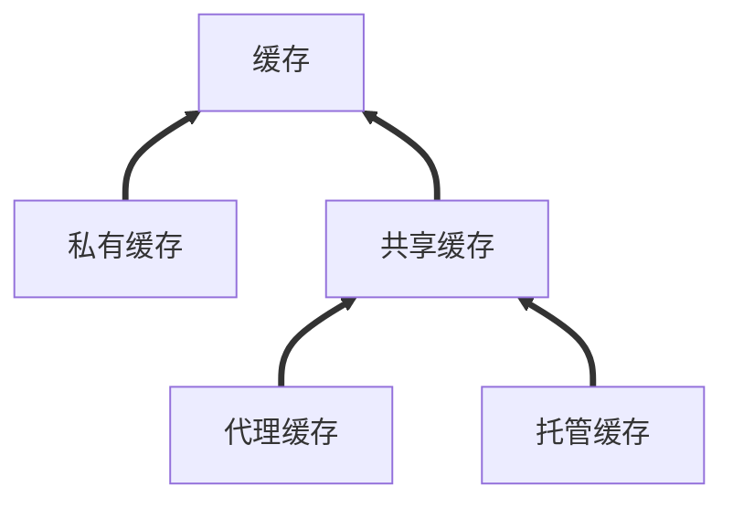
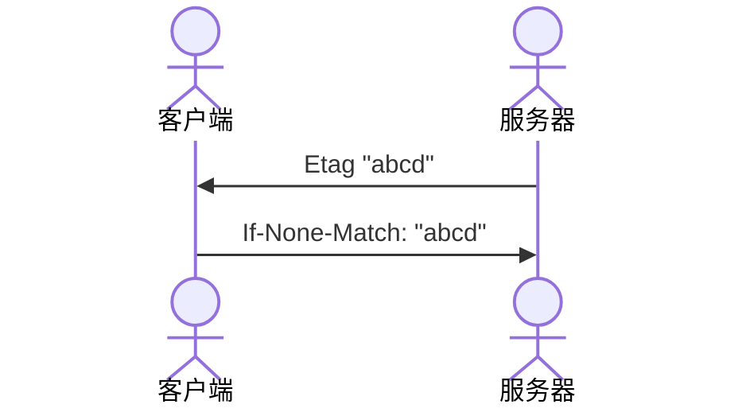
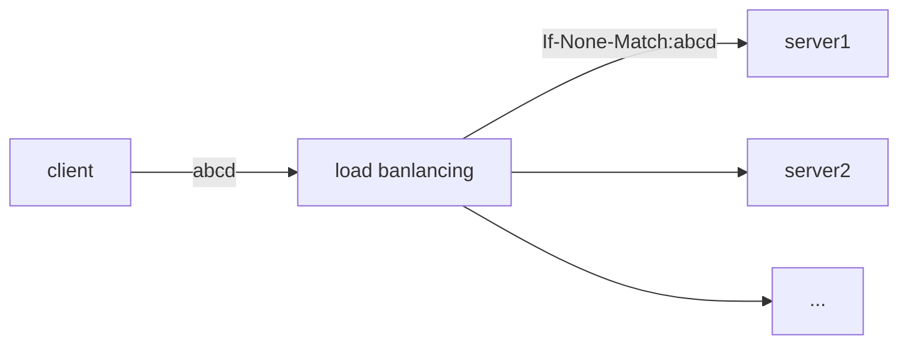
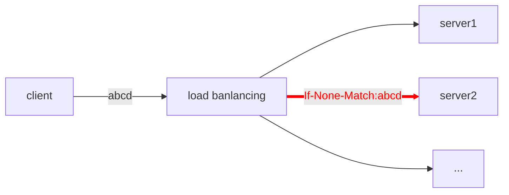

Vite 的重新加载
> Vite 同时利用 HTTP 头来加速整个页面的重新加载（再次让浏览器为我们做更多事情）：源码模块的请求会根据 `304 Not Modified` 进行协商缓存，而依赖模块请求则会通过 `Cache-Control: max-age=31536000,immutable` 进行强缓存，因此一旦被缓存它们将不需要再次请求。


1. 私有缓存，绑定到特定客户端不和其他客户端共享
2. 共享缓存，共享缓存位于客户端和服务器之间进一步分为代理缓存和托管缓存


![[http-cache.png]]


### 缓存方式

#### 基于 max-age 的缓存
响应的状态分为两种, 未过时和过时客户端会根据响应头中的 cache-control 当中的 max-age 进行缓存，超过了 max-age 指定的时间会将响应的状态设置为过时的
```http
HTTP/1.1 200 OK
Content-Length: 409259
Last-Modified: Fri, 28 Oct 2022 02:39:47 GMT
Cache-Control: max-age=0
Content-Type: application/json; charset=utf-8
Date: Tue, 01 Nov 2022 09:31:49 GMT
Connection: keep-alive
Keep-Alive: timeout=5
```

#### 启发式缓存
即使没有给出 cache-control 在满足一定条件之后，浏览器也会主动的缓存响应，比如
```http
HTTP/1.1 200 OK
Content-Type: text/html
Content-Length: 1024
Date: Tue, 22 Feb 2022 22:22:22 GMT
Last-Modified: Tue, 22 Feb 2021 22:22:22 GMT
```
根据 Date 和 Last-Modified 可以看出该响应已经一年没有修改，可以猜想在今后的一段时间，也不会更改此响应。这个“今后的一段时间”到底多长，取决于实现，http 的规范建议存储至少 10% 的时间

### 缓存验证
在响应过时之后，不会马上把响应内容丢弃，通过重新发起请求，如果重新发起的请求通过了源服务器的验证，那么可以重新之前的响应
http 通过两组 header 进行缓存验证
* 通过 If-Not-Modified
请求头
```http

```
响应头
```http
HTTP/1.1 200 OK
Content-Type: text/html
Content-Length: 1024
Date: Tue, 22 Feb 2022 22:22:22 GMT
Last-Modified: Tue, 22 Feb 2022 22:00:00 GMT
Cache-Control: max-age=3600
```
* 通过 Etag/If-None-Match
Etag 是一个资源标识符，由服务器任意生成（基于自定义的算法）

首先服务器在给首次请求中给客户端响应头里面会有 Etag 这个 header，这里的 Etag 内容是"abcd", 实际上一般是一个很长的哈希字符串，然后客户端再次请求的时候会自动带上 If-None-Match 请求头，If-None-Match 的内容就是 Etag 的内容，服务器通过比对当前请求内容的 Etag 和从请求头中的拿到的 If-None-Match，决定返回"304 Not Modifiled"或者是一个完整的新的响应

在一些服务器的 Etag 算法实现上，都是通过文件的修改时间和文件大小来生成 Etag，比如 [koa-etag](https://github.com/jshttp/etag) 的实现里面
```js
/**
 * Generate a tag for a stat.
 *
 * @param {object} stat
 * @return {string}
 * @private
 */
function stattag (stat) {
  var mtime = stat.mtime.getTime().toString(16)
  var size = stat.size.toString(16)
  return '"' + size + '-' + mtime + '"'
}
```
Etag 存在的问题是对于多个节点的情况下

如果此时负载均衡请求的节点将请求转发给 server2 ，将会认为是一个新的请求，因为 If-None-Match 和 server2 计算的 Etag 不一致

### 奇怪的现象
使用 curl 请求已缓存的资源显示 304 Not Modified
```sh
curl http://192.168.13.76/EHCommon/resources/map/Scene_1/Building_1/Floor_2d_1_1666927127.json --header 'If-None-Match: "216cd7b-5ec0fb74c9898"' -I
HTTP/1.1 304 Not Modified
Date: Tue, 01 Nov 2022 09:25:59 GMT
Server: Apache
ETag: "216cd7b-5ec0fb74c9898"
```
但是实际在浏览器中根本就没有带 `If-None-Match` 这个header，响应的状态码一直是 200 Ok
* 第一次请求
![[etag-1.png]]
* 第二次请求（已缓存）
![[etag-2.png]]