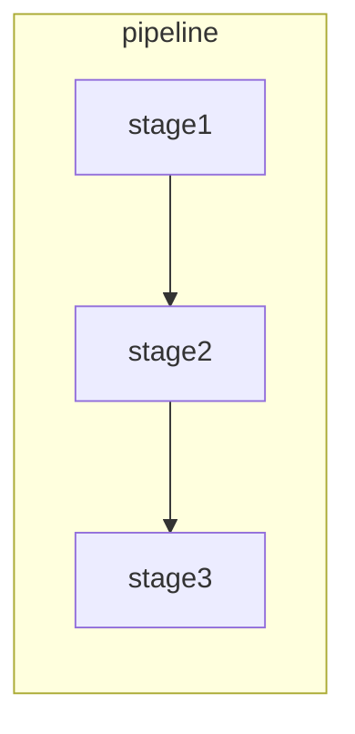
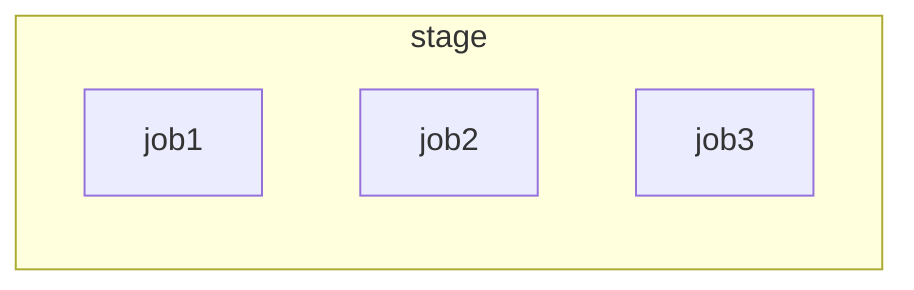

# CICD 入门
GItLab CICD 是帮助我们进行自动化测试或者自动化部署等功能的工具。

## 安装 Docker
在 https://www.docker.com/  下载对应的安装包即可

![[Pasted image 20230201142355.png]]
## 安装 GitLab
```sh
# 声明一个具名数据卷
export GITLAB_HOME=/srv/gitlab
 sudo docker run --detach \
  --hostname localhost \
  --publish 443:443 --publish 8889:8889 --publish 22:22 \
  --name gitlab \
  --restart always \
  --volume $GITLAB_HOME/config:/etc/gitlab:Z \
  --volume $GITLAB_HOME/logs:/var/log/gitlab:Z \
  --volume $GITLAB_HOME/data:/var/opt/gitlab:Z \
  --shm-size 256m \
  gitlab/gitlab-ce:latest
```
## 运行器 (runner)
GitLab 所有的CI任务都是在运行器上面执行的
1. 安装运行器
```sh
# 定义一个匿名数据卷 
docker volume create gitlab-runner-config
# 安装runner，注意`--net=host`这个配置
docker run -d --name gitlab-runner --restart always \
    -v /var/run/docker.sock:/var/run/docker.sock \
    -v gitlab-runner-config:/etc/gitlab-runner \
    --net=host gitlab/gitlab-runner:latest

```

## 注册一个运行器
可以使用三种不同的 Runner
1. 共享 runner （针对所有项目）
2. Group Runner（针对某一个组的项目）
3. 指定 Runner（针对指定的项目）

使用如下命令注册一个runner
```
# 给项目注册一个runner
docker run --net=host --rm -it -v gitlab-runner-config:/etc/gitlab-runner gitlab/gitlab-runner:latest register   
```

注册过程中所需的地址和项目验证令牌在项目的 Setting - CICD - Runners 中可以找到 (如下图)，注册 Runner 成功之后，可以看到分配给该项目的 runner
![[runner.png]]
然后就是选择 executor，gitlab-runner 提供了不同的 executor 用于不同场景下的构建任务。不同 executor 所具有的能力也有所不同，参考 https://docs.gitlab.com/runner/executors/#selecting-the-executor ，一般来说，选择 docker 即可
```ad-note
[1] 在 wsl 如果 executor 选择了docker，无法 pull 项目代码，需要修改 gitlab-runner 的配置，在 /etc/gitlab-runner/config.toml 中添加
~~~toml
network_mode = host
~~~
参考 https://docs.gitlab.com/runner/executors/docker.html

[2] 可以通过 `docker cp` 来修改 docker gitlab-runner 的配置
```

## `gitlab-ci.yml ` CI 文件
为了使用 CICD，需要定义 `gitlab-ci.yml` 文件，该文件可以定义想要运行的脚本

-  stages
stage 定义了什么时候去运行执行 jobs ，CI 所有的任务都在某个 stage 运行，下面定义了两个 stage lint 和 build，只有前一个 stage 的任务执行完成，才能执行下一个 stage 的任务。

```yaml
stages:
	- lint
	- build
```
- job
job 定义了要做什么
在任务（job）中可以通过 `stage` 指定, 在同一个 stage 里面的任务是可以是**并行执行**的

```yaml
job: lint-code
	stage: lint
```

```ad-note
如果任务运行在不同的runner里面，那么任务就是并行执行的，如果只有一个runner，那么可以通过配置runner来达到并行执行任务的效果。https://docs.gitlab.com/runner/configuration/advanced-configuration.html#the-global-section
```

- image
如果运行在 docker 中，可以指定要使用的 docker 镜像
```yml
image: 'node:18-slim'
```
