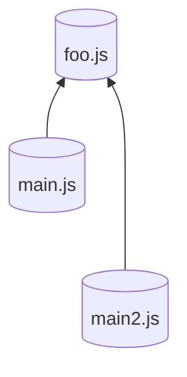

roll 的插件机制比较优秀，故单独提出来讲一下

### 如何使用插件
首先用官网的例子来介绍 rollup 的插件是如何使用
1. 初始化一个项目
```sh
pnpm init
```
2. 局部安装 rollup
```sh
pnpm add -D rollup
```
3. 安装 @rollup/plugin-json
```sh
pnpm add -D @rollup/plugin-json
```

4. 在**main. js**当中键入以下内容
```js
import {version} from "./foo.js"
export default function  () {
	console.log("version" + version)
}
module.exports = main
```
5. 在配置文件**rollup. config. js**当中添加以下配置
```js
// rollup.config.js
import json from '@rollup/plugin-json';

export default {
  input: 'src/main.js',
  output: {
    file: 'bundle.js',
    format: 'cjs'
  },
  plugins: [json()]
};
```
然后执行 `rollup -c`，输出以下内容
```js
'use strict';

var version = "1.0.0";

function main$1  () {
  console.log("version" + version);
}

module.exports = main;

module.exports = main$1;
```

可以看到, rollup 只导入了 version 字段，其余没有用到的内容都被忽略了, 这实际上就是**tree-shaking**

### 针对构建产物的插件
有些插件是专门针对已经构建好的代码，比如**rollup-plugin-terser**这个插件会最小化输出的代码, 安装该插件
```sh
pnpm add rollup-plugin-terser
```
然后编辑 rollup 配置文件, 增加一个最小化的打包构建
这里使用**iife**格式构建代码，这种格式的代码可以被浏览器用 script 标签引入，因为我们代码当中有一个导出，这个导出以全局变量的形式供其他代码使用，这里的**name**就是这个全局变量的名字
```js
import {terser} from "rollup-plugin-terser"
export default {
	output: [
		{
			file: "bundle.min.js",
			name: "version",
			format: "iife",
			plugins: [terser()]
		}
	]
}
```
执行 `rollup -c` 然后查看**bundle. min. js**的内容，可以发现
```
var version=function(){"use strict";return module.exports=main,function(){console.log("version1.0.0")}}();
```
构建出来的是最小化代码（去除了注释、换行等）

### 代码分割
rollup 会自动的将代码分割成几个块 (chunk), 比如说动态加载和多个入口点的情况。还可以使用代码分割的特性来实现**懒加载**（被导入的模块仅仅只在函数执行之后加载）
把最开始例子里面的静态导入改成动态导入
```js
export default function () {
	import ('foo.js').then(({default: foo}) => console.log(foo))
}
```
rollup 会使用动态导入来创造一个按需加载的块。为了让 rollup 知道我们生成的这些块文件放置在哪里，需要用 `-d` 选项传递一个目录
```sh
rollup src/main.js -f cjs -d dist
```
在**dist**目录下生成如下两个文件
```sh
├── foo-d03a9db4.js
└── main.js
```
被分割的出来的 chunk 文件，都是以 chunk-[hash]. js 的形式命名, 这是可以通过 `outputchunkfilenames` 配置的

多个模块共享同一段代码也会被分割


rollup 不会重复生成两份 foo. js

### 插件概览

rollup 中一个插件是一个对象，拥有一个或者多个属性、构建 hooks 函数和输出生成的 hooks 函数。插件遵循 rollup 的约定（后文细讲）。一个插件应该作为包来发布，这个包应该导出一个能被配置文件中 plugins 选项调用的函数
```js
export default{
	plugins: [pluginFunction()]
}
```
并且此函数返回一个同样的插件对象
例子
下面这个插件将在不访问文件系统的情况下拦截 `virtual-module` 的导入。如果想要在浏览器中使用 rollup，必须使用这个插件。如下所示，这个插件甚至能替换入口点
```js
// rollup-plugin-my-example.js
export default function myExample () {
  return {
    name: 'my-example', // this name will show up in warnings and errors
    resolveId ( source ) {
      if (source === 'virtual-module') {
        return source; // this signals that rollup should not ask other plugins or check the file system to find this id
      }
      return null; // other ids should be handled as usually
    },
    load ( id ) {
      if (id === 'virtual-module') {
        return 'export default "This is virtual!"'; // the source code for "virtual-module"
      }
      return null; // other ids should be handled as usually
    }
  };
}
```