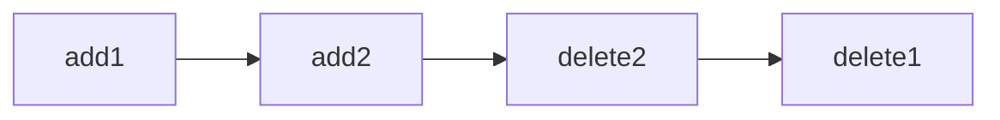
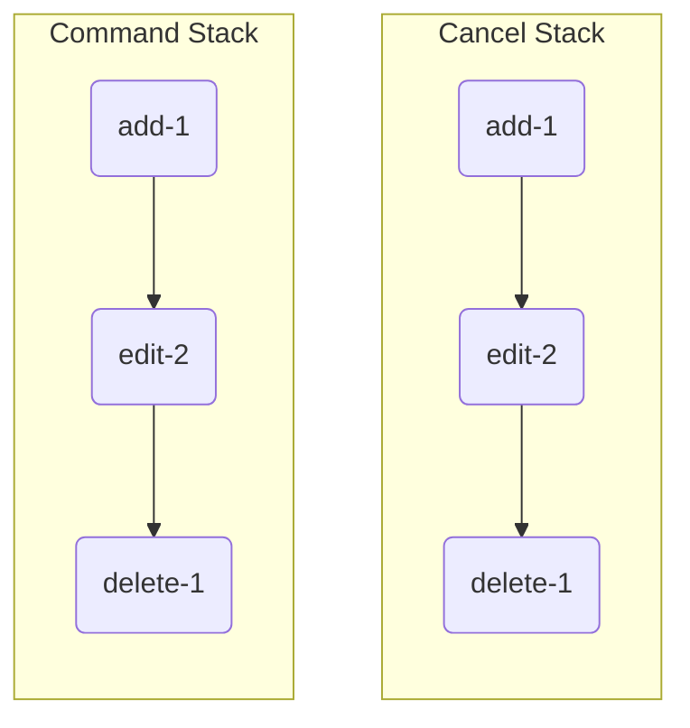

# Undo Redo 的设计
撤销和重做是一个编辑器当中的通用功能。

## op-based
+ `add(obj)`
+ `delete(obj)`
+ `edit(obj)`

| sid     | property     |
| ------- | ------------ |
| 4234123 | {property 1} |

== Command generating
the new and old both are object that contain SID.

| op     | result  |undo|
| ------ | ------- | ----|
| add    | - new     | `delete(new)` |
| delete | old -     | add(old) ` |
| edit   | old-new | `replace(old)` |

### Command Stack

`2k => w ==> 20MB`