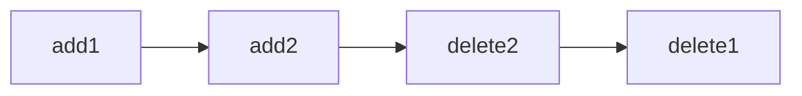
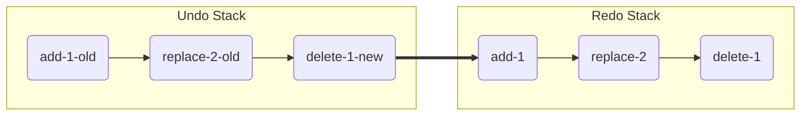

# Undo Redo 的设计

## 文本编辑器的 Undo Redo 实现
1. Rope data structure
2. Gap Buffer
3. Piece Table


## 地图编辑器的 Undo Redo 设计
撤销和重做是一个编辑器当中的通用功能。其核心在于经过 N 次 `undo` 操作可以通过 N 次 `redo` 操作回到保持状态不变
对于单个用户的系统来说，这实现起来并没有想象中的复杂

考虑有一个 A B C 的操作序列只要经过 C' B' A'就可以撤销所有操作，然后再次 A B C 的操作恢复所有操作, 

## op-based
+ `add(obj)`
+ `delete(obj)`
+ `edit(obj)`



if user undo N times , he must be can back to newest state.

| sid     | property     |
| ------- | ------------ |
| 4234123 | {property 1} |

== Command generating
the new and old both are object that contain SID.

| op     | result  |undo|
| ------ | ------- | ----|
| add    | - new     | `delete(new)` |
| delete | old -     | add(old) ` |
| edit   | old-new | `replace(old)` |

### Command Stack



`1000 node` => `1MB`  => `10M`


```StackItem

```