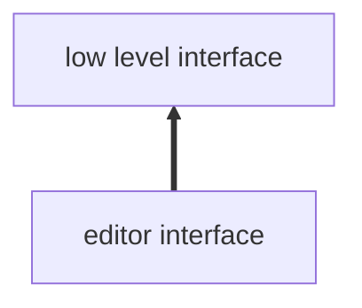
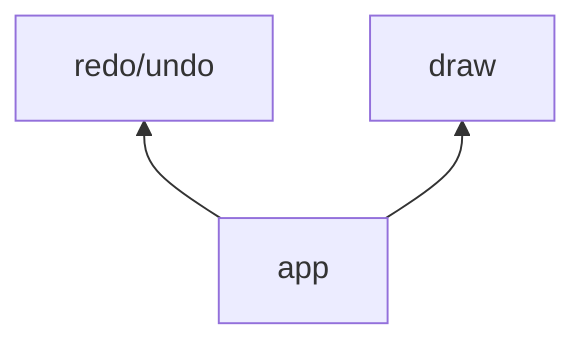

# 关于新的前端项目搭建构思
## lint 和 format
+ 使用 eslint 进行静态语法检查
+ 使用 prettier 文本格式化

## css 框架
- 不适用 sass less 等 css 预处理器，使用现代的 css-nesting 语法
- 对于需要快速开发项目，尽可能的使用原子类

## 依赖处理
### 将出于不同抽象层次的代码相分离，比如

编辑器依赖于底层的接口，编辑器和底层的接口不应该耦合，应该互相保持独立

### 将处于不同逻辑块的代码分离
在开发一个应用时，通常会根据功能进行划分。单独功能应该保持独立，他们的耦合应该放置在调用处

