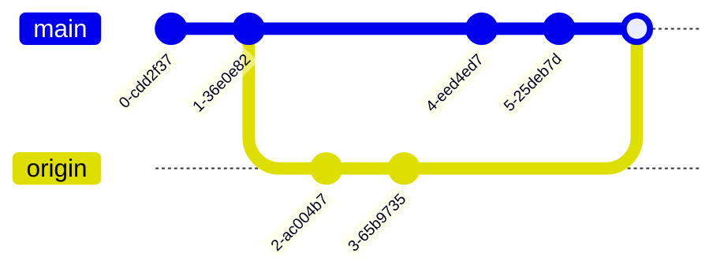

找到我们需要解决的冲突
使用`git status` 可以找到项目中产生冲突的文件
![[Pasted image 20221029081555.png]]
可以看到git提示我们使用`git add [file-name]`来标记最终的方案


如果只要要用其他分支的代码覆盖本地分支，直接在git pull的时候选择
```sh
git pull -X theirs
```
如果要用本地分支的代码覆盖其他分支
```sh
git pull -X ours
```


[Git merge strategy options & examples | Atlassian Git Tutorial](https://www.atlassian.com/git/tutorials/using-branches/merge-strategy)
[Git - git-pull Documentation (git-scm.com)](https://git-scm.com/docs/git-pull)