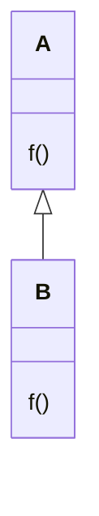

## 契约式设计（design by contract）
![[desgin-by-contract.png]]
契约双方是**调用者**和**被调用者**

一个调用必须满足
+ 前置条件 (pre-condition)
+ 后置条件 (post-condition)
+ 不变式

调用者必须满足前置条件
被调用者的方法必须满足后置条件
不变式是被调用者应该一致保持的条件


```ts
interface Stack {
	pop(): number
	push(param: number): void
}
```

例如，
1. Stack 的调用者在使用 pop 之前必须满足 Stack 中元素的数量大于 0 这就是前置条件
2. 而 pop 方法本身应该保证被调用之后 Stack 中的元素数量减少 1 个，这是后置条件
3. 调用前后，Stack 中的元素数量始终都是大于等于 0, 这就是不变式，在方法的调用前后都始终成立

### 派生类中覆写方法



假设 B 类想要覆写 A 类中的 f 方法，那么必须满足的条件是
1. f 的前置条件被弱化
2. f 的后置条件被强化

先别急着理解上述两个条件，考虑以下场景
```ts
// 参数是类A的实例
function foo(a: A) {
	a.f()
}

foo(a) // 正确
```

我们要保证的是函数 `foo` 在传入 `b` 的情况下仍然能够工作，而显然满足这上面两个条件（即放宽前置条件，缩窄后置条件）就能保证传入派生类 B 的实例，函数 foo 也能正常工作
```ts
// b是类B的实例
foo(b) // 正确
```


### 契约式设计的实践
在实践当中，除了契约式设计，使用最多的还有大名鼎鼎的“[防御式编程]( https://zh.wikipedia.org/zh-sg/%E9%98%B2%E5%BE%A1%E6%80%A7%E7%BC%96%E7%A8%8B ) ”, 防御式编程的特点就是调用者需要做一冗余的检查。例如一个对正整数开平方根的函数 `square`，该函数（被调用者）会对传入的参数进行大于 0 的检查
```ts
function square(n: number) {
	assert(n > 0);
	// do something ...
}
```

但是在契约式设计中，这个检查应该由调用者满足。因此契约式设计要求提供良好的文档，而且要对团队成员有充分的了解和信任

```ts
function caller(n: number) {
	if(n <= 0) {
		throw new Error("parameter must be no-negative")
	}
	// do something ...
}

```
否则的话，还是使用防御式编程更好，不过契约式设计中覆写父类方法的原则，仍然是需要遵守的

### 开闭原则

可扩展性和闭合性针对的维度不同，可扩展性，