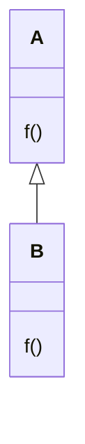

## 契约式设计（design by contract）

契约双方是**调用者**和**被调用者**

一个调用必须满足
+ 前置条件 (pre-condition)
+ 后置条件 (post-condition)
+ 不变式

调用者必须满足前置条件
被调用者的方法必须满足后置条件
不变式是被调用者应该一致保持的条件

```ts
interface Stack {
	pop(): number
	push(param: number): void
}
```

例如，
1. Stack 的调用者在使用 pop 之前必须满足 Stack 中元素的数量大于 0 这就是前置条件
2. 而 pop 方法本身应该保证被调用之后 Stack 中的元素数量减少 1 个，这是后置条件
3. 调用前后，Stack 中的元素数量始终都是大于等于 0, 这就是不变式，在方法的调用前后都始终成立

### 派生类中覆写方法


假设 B 类想要覆写 A 类中的 f 方法，那么必须满足的条件是
1. f 的前置条件被弱化
2. f 的后置条件被强化

先别急着理解上述两个条件，考虑以下场景
```ts
// 参数是类A的实例
function foo(a: A) {
	a.f()
}

foo(a) // 正确
```

我们要保证的是函数 `foo` 在传入 `b` 的情况下仍然能够工作，而显然满足这上面两个条件（即放宽前置条件，缩窄后置条件）就能保证传入派生类 B 的实例，函数 foo 也能正常工作
```ts
// b是类B的实例
foo(b) // 正确
```

## 开闭原则
“软件模块应该对修改关闭，对扩展开放”这句大名鼎鼎的话就是对开闭原则的最简单阐释

修改是指破坏原有的类，最早提出开闭原则的*Bertland Meyer* 认为只有在一个类错误的情况下才能去修改它，如果要添加新的特性应该通过新增的类来实现。[^1]。*Bertland Meyer* 倡导使用**继承**实现功能的扩展

%%想到了一个有趣的比喻，父母就和既有的软件模块一样，在无法改变自己的情况下，只能希冀子女（派生类）来达到自己不曾达到的目标

*Robert Cecil Martin* 在其文章 [*The open and closed Principles*](./OCP-1996.pdf) 中详细阐述了使用开闭原则的益处, 以及开发程序为什么要符合开闭原则。

*Robert Cecil Martin*强调了开发一个符合开闭原则的程序，抽象非常关键

当然一个共有的认知是：没有程序能够 100% 的保证对修改封闭。总会有需求使得必须修改原有的软件模块才能达到目的%%

### 示例

version 1 函数 `drawAllShapes` 对修改不关闭，如果新增一个 shape ，每次都必须修改 `drawAllShapes` 。这种修改看起来很简单，但实际上系统中可能很多地方都有类似的条件判断，每次新增一种 shape 都要在系统中全局查找引用到的地方

```ts
const enum ShapeType {
	circle,
	triangle,
	square,
}

class Shape {
	abstract type: ShapeType
}

class Circle {
	readonly type: ShapeType.circle = ShapeType.circle
}

class Square {
	readonly type: ShapeType.square = ShapeType.square
}

function drawAllShapes(shapes: Shapes[]) {
	for(const shape of shapes) {
		switch(shape.type) {
			case shape.circle: drawCircle(shape);break;
			case shape.square: drawSquare(shape);break;
			...
		}
	}
}
```

version 2
```ts
class Shape {
	abstract type: ShapeType
	abstract draw: () => void
}

class Circle extends Shape {
	readonly type: ShapeType.circle = ShapeType.circle
	draw() {/***/}
}

class Square extends Shape {
	readonly type: ShapeType.square = ShapeType.square
	draw() { /***/}
}

function drawAllShapes(shapes: Shapes[]) {
	for(const shape of shapes) {
		shape.draw()
	}
}
```


进一步，如果要考虑以某种特定顺序绘制图形，比如先绘制 circle 然后再绘制 square ，每次

version 1 
```ts
function drawAllShapes(shapes: Shapes[]) {

	shape.sort((a,b) => {
		if(a.type ===  b.type) 
			return 0;
			
		if(a.type === ShapeType.circle && b.type === ShapeType.square) return -1;
		
		return 1;
	})
	
	for(const shape of shapes) {
		shape.draw()
	}
}
```

因为增加了排序逻辑，`drawAllShapes` 函数在每添加一种 shape 时，仍然需要进行再次修改，如何使`DrawAllShapes`函数不受绘制顺序变化的影响？封闭性是建立在抽象之上的。因此，为了使`DrawAllShapes`不受顺序影响，我们需要某种形式的“顺序抽象”。


version 3
```ts
class Shape {
	abstract type: ShapeType
}

const priority = [ShapeType.circle, ShapeType.square, ShapeType.triangle]

function sortShape(shapes: Shapes[]) {
	return shapes.sort((a, b) => {
		const priority_a = priority.indexOf(shape)
		const priority_b = priority.indexOf(shape)
		return priority_a - priority_b;
	})
}

function drawAllShapes (shapes: Shapes[], sortShape) {
	const shapes = sortShape([...shapes])
	
	shape.sort((a,b) => {
		if(a.type ===  b.type) 
			return 0;
			
		if(a.type === ShapeType.circle && b.type === ShapeType.square) return -1;
		
		return 1;
	})

	return shapes.forEach(shape => shape.draw())
}
```


## 参考文档
1.  [开闭原则-wiki](https://zh.wikipedia.org/zh-cn/%E5%BC%80%E9%97%AD%E5%8E%9F%E5%88%99#cite_note-3)
